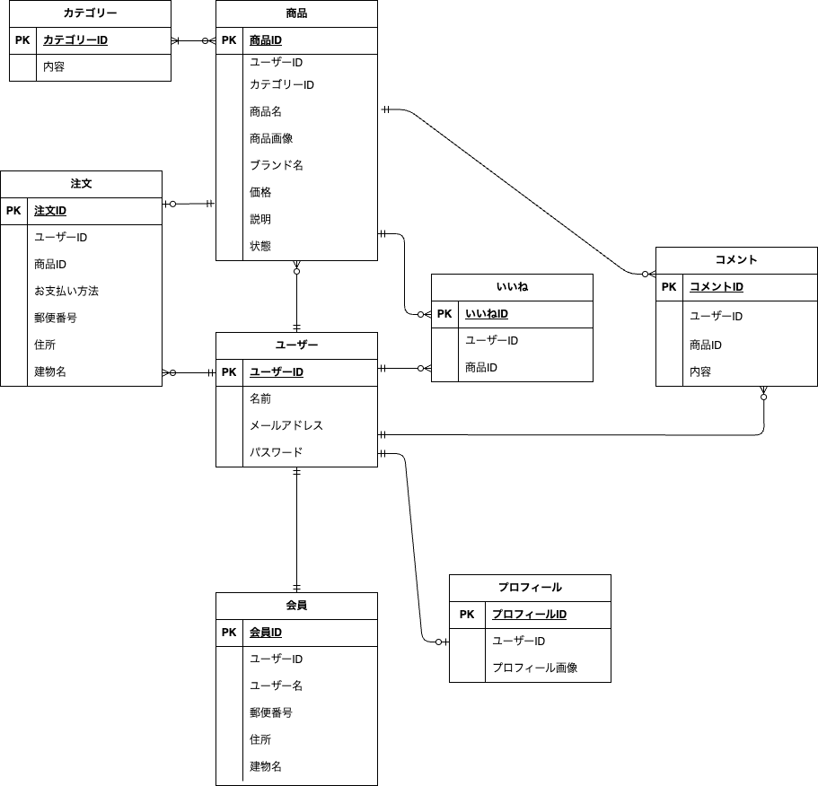
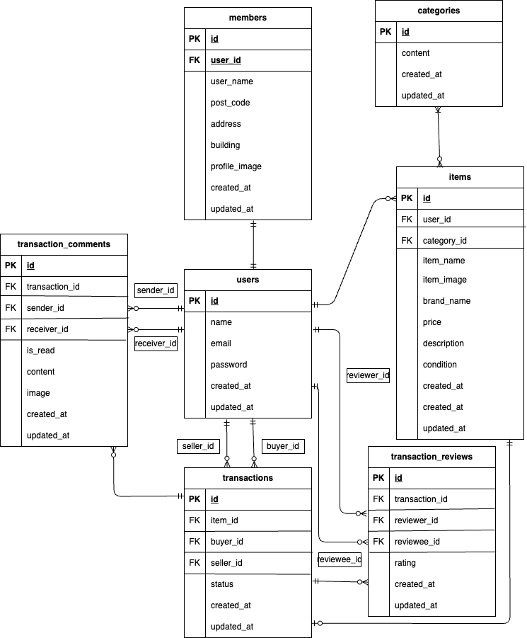

# flea-market

## 環境構築

**Dockerビルド** 
1,git clone https://github.com/risa-prog/flea-market.git 
2,docker-compose up -d --build

**Laravel環境構築** 
1,docker-compose exec php bash 
2,composer install 
3,.env.exampleファイルから.envを作成し、環境変数を変更 
4,php artisan key:generate 
5,php artisan migrate 
6,php artisan db:seed 

## 使用技術(実行環境)

•PHP 7.4 
•Laravel 8.83 
•MySQL 8.0 
.JavaScript 

## 開発環境

•home画面:http://localhost/ 
•会員登録:http://localhost/register 
•phpMyAdmin:http://localhost:8080/ 
•MailHog:http://localhost:8025

## ER図

 
  
(今回追加分) 

## メールの受信確認について

MailHogというツールを使用しています。
.envファイルのMAIL_FROM_ADDRESSは任意のメールアドレスを入力してください。　取引完了後、出品者にメールが送られてきます。

## ダミーデータについて

ユーザー1:太郎　CO01からCO05までの商品データを出品しています。CO06,CO07の商品を購入して、取引中です。 
ユーザー2:花子　CO06からCO10までの商品データを出品しています。CO01,CO02の商品を購入して、取引中です。 
ユーザー3:商品を出品していません。CO03,CO08の商品を購入して、取引中です。 
また、商品の購入はホームページの「購入する」より購入してください。購入後、取引が始まります。

## 画像の表示について

アプリ内でユーザーのプロフィール画像や商品画像を表示するために、Laravel のストレージとパブリックディレクトリを結ぶ シンボリックリンクの作成 が必要です。以下のコマンドを実行してください。 
php artisan storage:link 
コマンド実行後、お好きな画像をformよりアップロードしてください。
